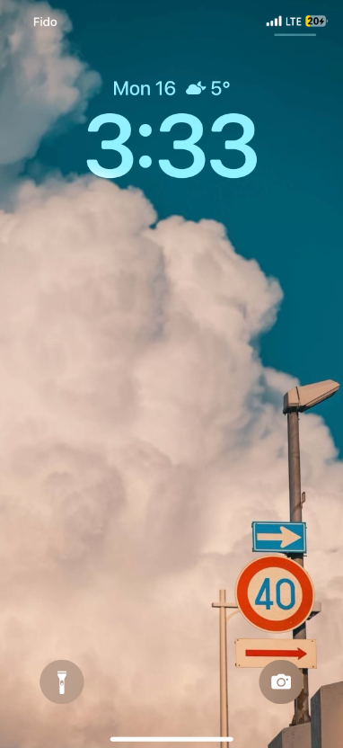
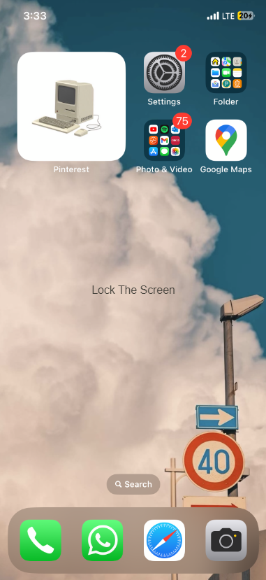

#The Guitar Screen Unlock

The Guitar Screen Unlock offers an innovative way to access your device, serving as a distinctive alternative to the conventional swipe-to-unlock feature. After brainstorming concepts such as 'Cosmic Unlock' and 'Zodiac Unlocks' 
(detailed further [here](https://kaihochak.github.io/)), we selected this idea for its unique and enjoyable nature. Throughout the development of this unlocking system, we've implemented enhancements like integrating sound and refining 
the user interface to achieve a more modern and seamless experience. For additional details on accessing this feature, please refer to the information provided below.

## Contributors

- Kai Ho Chak
- Htet Myet Aung Naing
- Kusumpreet Kaur Heer
- Logan Perry-Din

## Installation

These installation tips are a 'key' to simplicity!

[Click here to start unlocking!](https://kaihochak.github.io/)

OR Follow these simple steps to run the code for The Guitar Unlock on your local machine:

1. Clone the repository to your computer using your preferred version control tool or by downloading the ZIP archive.
2. Open your favorite code editor or integrated development environment (IDE).
3. Run the code on a local server using your IDE's live server feature.
4. That's it! You're ready to use The Guitar Screen Unlock on your own machine.

##Screens

###Lock Screen

This is the Lock Screen, hold and swipe up to go to the Unlock Screen.

###Wrong Unlock Screen

Select the cords you want to play and strum them from left to right. When the wrong cords are struck.

https://github.com/kaihochak/guitar-screen-lock/assets/55485344/d0c63df3-2177-4d03-940c-9078b73fc8de

###Correct Unlock Screen

Select the cords you want to play and strum them from left to right. When the right cords are struck.

https://github.com/kaihochak/guitar-screen-lock/assets/55485344/27e26e4f-98be-4ebb-991d-f36b72b533f4

###Home Screen

This is the home screen, it is displayed when the device is successfully unlocked. 

 

